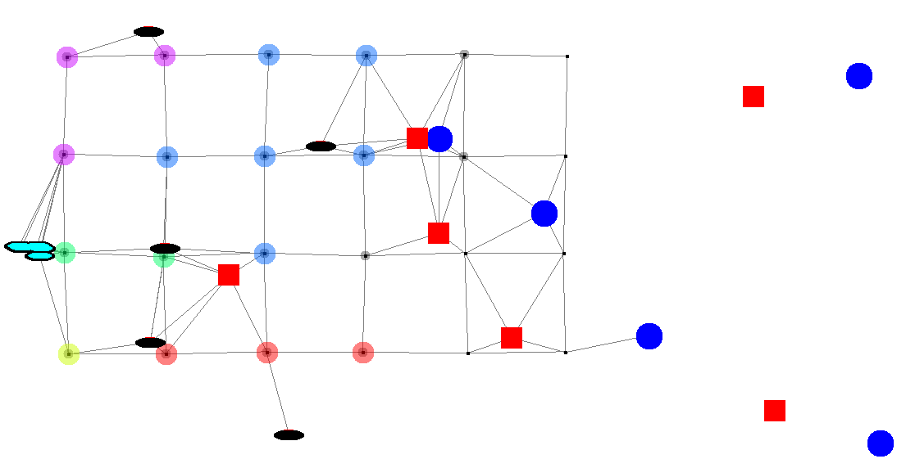
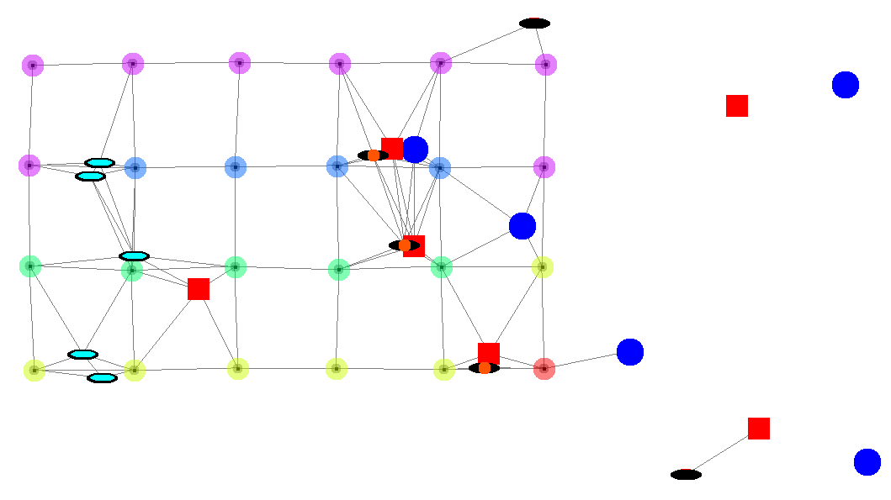
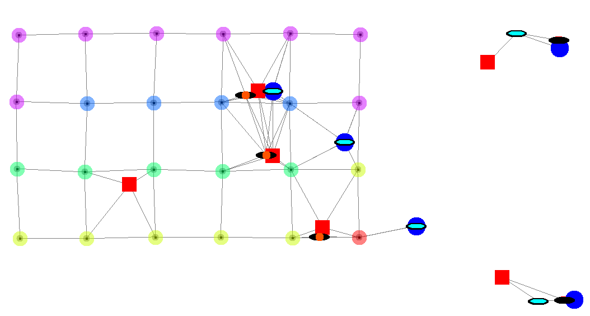

# Spatiotemporal Tuples - Simulations

Repository with source code, experimental framework, and tools for Spatiotemporal Tuples,
 a model covered in a paper submitted to COORDINATION 2021.

For any issues with reproducing the experiments, please contact [Roberto Casadei](https://robertocasadei.github.io)
 e.g. [via e-mail](mailto:roby.casadei@unibo.it).

## Overview

This repository contains the following

1. An implementation of the Spatiotemporal Tuples model, in ScaFi
2. Simulation infrastructure (Alchemist-ScaFi) for assessing the implementation
3. Scripts and tools for running simulations

The following tools are used:

* [ScaFi](https://scafi.github.io): an aggregate programming framework
* [Alchemist](https://alchemistsimulator.github.io): a flexible (meta-)simulator for multi-agent systems
* Java 11: the platform upon which ScaFi and Alchemist run
* git: version control system for keeping track of this repository
* Gradle: build system automating compilation and execution of the application
* Python: for generating plots from data produced by sampling the simulations

## Getting started

### 1. Importing the repository

The first step is cloning this repository. It can be easily done by using git. Open a terminal, move it into an empty folder of your choice, then issue the following command:

```bash
# HTTPS
git clone https://github.com/metaphori/experiment-2021-spatiotemporaltuples.git
# SSH
git clone git@github.com:metaphori/experiment-2021-spatiotemporaltuples.git
# Change directory to the repository
cd experiment-2021-spatiotemporaltuples
```

### 2. Smoke test

This should make all the required files appear in your repository, with the latest version.

To check if everything works as expect, run the following command to start a GUI-based simulation (it may take some time to bootstrap):

```
./gradlew st
```

Once the GUI shows up, press `P` to start the simulation.

### 3. Open the project with an IDE

- **Eclipse**: open Eclipse, click on "File > Import" and then on "Gradle > Existing Gradle Project", then select the folder of the repository donwloaded in the previous step.
- **IntelliJ Idea**: similarly

## Project layout

The main files and directories of the project are the following:

- `build.gradle.kts`: the project build file; specifies dependencies and tasks
- `src/main/yaml/`: contains declarative simulation descriptors as YAML files
- `src/main/scala/`: contains implementation code

### Main source files

- `src/main/scala/it/unibo/spatialtuples/SpatialTuplesSupport.scala`: contains the implementation of the tuple operations as ScaFi aggregate processes
- `src/main/scala/it/unibo/experiments/SpatialTuplesStorm.scala`: contains the program played by the nodes in the correctness simulation described
  by file `src/main/yaml/spatialtuples.yaml`
- `src/main/scala/it/unibo/casestudy/SpatialCoordination.scala`: contains the program played by the nodes in the rescue case study
 described by file `src/main/yaml/spatialcoord.yaml`

## Simulations about correctness

Type

```bash
./gradlew moving
```

for running the batch of experiments (NOTE: it requires a lot of resources and might take a lot of time).
Data produced by the simulator will be writted to directory data/raw/ (the output is one CSV file per simulation run).

Key files

- `src/main/scala/it/unibo/experiments/SpatialTuplesStorm.scala`: contains the program played by the nodes in the correctness simulation described
  by file `src/main/yaml/spatialtuples.yaml`

To process data and generate plots, issue

```bash
./plotter.py plots/spatialtuples.yml data/ .* somename
```

### High-resolution plots

- [Plot 1](assets/imgs/mov_0_speed-10.pdf)
- [Plot 2](assets/imgs/mov_1_speed-10.pdf)

## Rescue case study

Type

```bash
./gradlew casestudy
```

to run the graphical simulation of the rescue case study.

Key files

- `src/main/scala/it/unibo/casestudy/SpatialCoordination.scala`: contains the program played by the nodes in the rescue case study
 described by file `src/main/yaml/spatialcoord.yaml`

### Simulation phases






